# Explore România 
**Echipa Ubibisoft**

<a>
  
</a>

[ro](#română)
[en](#engleză)

### 1. INTRODUCERE

#### 1.1 Scopul 
Acest document de proiectare software (SDD) descrie arhitectura detaliată și designul sistemului pentru aplicația „Explore România”. Documentul este destinat echipei de dezvoltare (Ubibisoft), cadrelor didactice interesate de procesul tehnic și evaluatorilor de proiect, oferind o viziune clară asupra modului în care cerințele educaționale sunt traduse în soluții tehnice.

#### 1.2 Domeniul de aplicare 
„Explore România” este o aplicație mobilă Android concepută ca un instrument didactic interactiv. 
- **Obiective:** Facilitarea învățării materiilor Istorie și Geografie pentru elevii de clasa a IV-a prin mecanici de joc (gamification).
- **Beneficii:** Transformarea procesului de evaluare dintr-o activitate stresantă într-una distractivă, stimularea curiozității prin colectarea de stickere și fixarea cunoștințelor prin utilizarea indiciilor logice.
- **Scop:** Proiectul acoperă livrarea unui prototip executabil care include harta interactivă a României, sistemul de quiz și modulul de recompense.

#### 1.3 Prezentare generală 
Acest document este organizat în secțiuni care acoperă analiza utilizatorilor, arhitectura tehnică bazată pe Kotlin și Jetpack Compose, detaliile de implementare a interfeței (UI) și mecanicile de joc. Sunt incluse, de asemenea, detalii despre accesibilitate și planurile de dezvoltare viitoare pentru extinderea funcționalităților către un panou de administrare.

#### 1.4 Materiale de referință
Sursele de informație utilizate pentru definirea conținutului și a planului de testare includ:
1. *Istorie clasa a IV-a*, Cleopatra Mihăilescu, Tudor Pițilă.
2. *Geografie clasa a IV-a*, Carmen Camelia Rădulescu, Ionuț Popa.
3. Principiile HCI (Interacțiune Om-Calculator) studiate în cadrul cursului.


### 2. PREZENTARE GENERALĂ A SISTEMULUI 
#### 2.1 Descriere Generală și Funcționalitate
„Explore România” este o aplicație mobilă educațională bazată pe conceptul de „învățare prin joc” (gamification). Funcționalitatea principală permite elevilor să parcurgă o hartă interactivă a României, structurată sub forma unui traseu de tip „Monopoly”.

Sistemul integrează următoarele funcții cheie:

- **Modulul de Explorare**: Navigarea prin județele țării, unde fiecare oprire reprezintă o provocare academică.

- **Motorul de Quiz**: Generarea de întrebări din Istorie și Geografie cu trei variante de răspuns și un sistem de indicii logice care ghidează utilizatorul către răspunsul corect în caz de eroare.

- **Economia Jocului**: Un sistem de punctaj care recompensează succesul academic, permițând achiziția de „cufere” cu recompense.

- **Sistemul de Colecționare**: Un album virtual de stickere (cu rarități diferite) care stimulează retenția utilizatorului și dorința de completare a obiectivelor.

#### 2.2 Contextul Proiectului
Aplicația a fost dezvoltată în contextul cursului de Interacțiune Om-Calculator (HCI), având la bază un proces de design centrat pe utilizator. Proiectul a pornit de la nevoia cadrelor didactice de a avea instrumente moderne care să capteze atenția elevilor de clasa a IV-a (generația nativilor digitali).

Contextul de utilizare este unul hibrid:

**Educație formală**: Utilizată în clasă, sub supravegherea profesorului, pentru consolidarea cunoștințelor.

**Educație informală**: Utilizată acasă, ca activitate recreativă care înlocuiește jocurile pur comerciale cu o alternativă educativă.

#### 2.3 Designul Sistemului
Designul este unul data-driven și modular, facilitând extensibilitatea.

**Interfața** (UI): Construită în Jetpack Compose, urmează principii de accesibilitate specifice vârstei: butoane mari, iconografie sugestivă, culori vibrante și feedback sonor/vizual imediat.

**Logica de Business**: Separarea clară între motorul de joc și baza de date de întrebări (stocată în fișiere JSON). Acest design permite modificarea conținutului educațional fără a interveni asupra codului sursă.

**Identitatea Vizuală**: Include personaje personificabile și sprite-uri animate pentru a crea o conexiune emoțională între elev și mediul de învățare.

#### 2.4 Informații de Context 
Proiectul a fost rafinat în urma consultării unui eșantion de 30 de elevi. Din acest background au reieșit elemente critice de design, precum necesitatea unui avatar personalizabil și includerea unor elemente de colecționare tip „Panini”, care s-au dovedit a fi factori motivaționali mult mai puternici decât simplul punctaj numeric. Documentul de față descrie prototipul rezultat din acest proces de cercetare și implementare.


### 3. ARHITECTURA SISTEMULUI

#### 3.1 Proiectarea Arhitecturală
Sistemul este construit pe o arhitectură modulară, bazată pe principiile **Clean Architecture** adaptate pentru ecosistemul Android. Responsabilitățile sunt divizate în subsisteme clar definite care colaborează pentru a oferi o experiență de utilizare fluidă.

Principalele subsisteme identificate sunt:

* **Subsistemul de Navigare și Control (Router):** Gestionează fluxul utilizatorului între ecrane (Home, Gameboard, Quiz, Collection) și asigură persistența stării aplicației în timpul navigării.
* **Subsistemul Logicii de Joc (Game Engine):** Responsabil pentru regulile de avansare pe hartă, verificarea răspunsurilor în modul Quiz și gestionarea sistemului de indicii.
* **Subsistemul de Recompense (Reward Manager):** Administrează logica de „gacha” pentru deschiderea cuferelor, calcularea rarităților și actualizarea albumului de stickere.
* **Subsistemul de Gestiune a Datelor (Data Layer):** Interfața cu depozitele de date (Repository). Acesta citește întrebările din JSON și salvează progresul prin DataStore.

**Diagrama Componentelor și Depozitelor de Date:**

```mermaid
graph TD
    A[Interfața Utilizator - Jetpack Compose] --> B[ViewModels - Logica de Prezentare]
    B --> C[Repositories - Gestiune Date]
    C <--> D[Assets - JSON/CSV]
    C <--> E[DataStore - Persistență Locală]
    E <--> F[Scoruri / Colecție Stickere]
```


#### 3.2 Descrierea Descompunerii
Descompunerea sistemului urmează o abordare orientată pe obiecte și module funcționale, structurată în pachetul `com.ububi.explore_romania`:

Module de UI (`ui/`): Fiecare modul (`home`, `gameboard`, `quiz`, `chest`) funcționează ca un subsistem independent din punct de vedere vizual, comunicând cu restul aplicației prin intermediul `AppRouter`.

**Modele de Date** (**Domain Models**): Clase precum `Sticker`, `StickerRarity` și `CountyInfo` definesc obiectele fundamentale cu care lucrează subsistemele.

**Ierarhia de Generalizare**: Toate entitățile de tip "Întrebare" moștenesc o structură de bază, facilitând extensibilitatea între materii (Istorie/Geografie).

**Fluxul de Date** (**Sequence**): 
1. Utilizatorul alege un județ pe hartă. 
2. `InfoRepository` furnizează datele necesare. 
3. `QuizManager` preia întrebarea corespunzătoare și o afișează. 
4. La un răspuns corect, `DataStore` actualizează scorul, declanșând o notificare în subsistemul de recompense.

#### 3.3 Raționamentul Proiectării
Alegerea unei arhitecturi **Data-Driven** și a framework-ului **Jetpack Compose** a fost dictată de mai mulți factori critici:

**Extensibilitate**: S-a ales separarea conținutului (JSON) de cod pentru a permite adăugarea de noi întrebări fără a recompila aplicația. O arhitectură monolit ar fi făcut acest proces rigid.

**Performanță pe dispozitive mobile**: Utilizarea `DataStore` în detrimentul unei baze de date SQLite complexe (precum Room) a fost preferată deoarece volumul de date stocat (scoruri și ID-uri de stickere) este mic, iar DataStore oferă o viteză de acces superioară și siguranță în lucrul cu thread-urile (bazat pe Coroutines și Flow).

**Compromisuri**: S-a luat în considerare stocarea remote a datelor din prima fază, dar s-a renunțat în favoarea stocării locale (`assets/`) pentru a garanta funcționarea aplicației în zone cu conectivitate limitată (de exemplu, în școli cu semnal slab), prioritizând disponibilitatea resurselor educaționale în orice moment.

### 4. PROIECTAREA DATELOR

#### 4.1 Descrierea Datelor
Informațiile din domeniul educațional (întrebări, date geografice) și progresul utilizatorului sunt transformate în structuri de date digitale optimizate pentru performanță și mentenanță pe dispozitive mobile. Sistemul utilizează o abordare hibridă pentru organizarea și stocarea datelor:

* **Date Statice (Assets - Read Only):**
    * Conținutul educațional este decuplat de logica aplicației și stocat în fișiere de tip **JSON** și **CSV** în directorul `assets`. Această structură permite actualizarea curriculei (adăugarea de întrebări noi) fără a modifica codul sursă Kotlin.
    * Imaginile și sunetele sunt gestionate ca resurse brute, referențiate dinamic pe baza ID-urilor din fișierele de date.

* **Date Dinamice (Persistență - Read/Write):**
    * Starea utilizatorului, identitatea acestuia (nume, avatar) și progresul (scor, stickere colectate) sunt gestionate prin **Jetpack DataStore**.
    * Se utilizează *Preferences DataStore* pentru a stoca datele sub formă de perechi cheie-valoare, procesate asincron prin Kotlin Coroutines și Flows pentru a asigura o interfață fluidă.

**Elemente de stocare a datelor:**
1.  `intrebari_geografie.json` / `intrebari_istorie.json`: Baze de date documentare ce conțin array-uri de obiecte de forma:
```json
{
    "judet": string,
    "intrebari": [
        {
            "id": string,
            "text": string,
            "raspunsuri": [string, string, string],
            "raspuns_corect": string,
            "locatie": string,
            "hint": string
        }
    ]
}
```
2.  `info_judete.json`: Fișier ce conține descrierile detaliate ale județelor, afișate după deblocare:
```json
{
    "id": 14,
    "judet": "Cluj",
    "descriere": "Cluj-Napoca este inima Transilvaniei..."
  }
```
3.  `judete.csv`: Registru de coordonate și metadate pentru generarea hărții interactive.
4.  `user_preferences.pb` (DataStore): Fișier intern gestionat de Android pentru persistența profilului și colecției.

#### 4.2 Dicționar de Date
Următorul tabel detaliază entitățile majore (Obiecte/Clase) definite în arhitectura orientată pe obiecte a sistemului, împreună cu atributele și metodele lor principale.

| Entitate / Obiect | Atribute (Tip) | Metode Principale | Descriere |
| :--- | :--- | :--- | :--- |
| **PlayerPreferences** | `name: String`<br>`character_id: Int`<br>`coins: Int`<br>`current_streak: Int`<br>`pending_coins: Int`<br>`max_streak: Int` | `savePendingCoins()`<br>`resetGameSession()` | Obiectul principal care reține starea și progresul utilizatorului în joc. |
| **Question** | `text: String`<br>`answers: List<String>`<br>`correctIndex: Int`<br>`hint: String` | `getRandomQuestionForCounty(county, category)` | Reprezintă o unitate didactică de evaluare. Este deserializată din JSON. |
| **County** | `id: String`<br>`name: String`<br>`image: ImageBitmap` | `loadBoardData()`<br>`readAllCountiesMetadata()` | Gestionează starea vizuală și logică a unui județ pe harta interactivă. |
| **Sticker** | `id: Int`<br>`name: String`<br>`rarity: StickerRarity` | | Reprezintă elementul de recompensă vizualizat în album. |
| **StickerRarity** | `type: Enum` (COMMON, RARE, EPIC, LEGENDARY)<br>`dropRate: Float` |  | Enumerație care definește logica probabilistică pentru deschiderea cuferelor. |


**Descrierea parametrilor funcțiilor cheie:**

* **`getRandomQuestionForCounty(county, category)`**:
    * *county*: Județul pentru care se solicită o întrebarea.
    * *category*: Materia de studiu selectată pentru întrebare.


### 5. DESIGNUL COMPONENTELOR

În această secțiune este detaliată funcționarea sistematică a componentelor principale ale aplicației. Descrierea se concentrează pe algoritmii care guvernează logica de joc, sistemul de recompense și gestiunea progresului.

#### 5.1 Componenta de Gestiune a Quiz-ului (Quiz Logic)

Această componentă este responsabilă pentru încărcarea întrebărilor din fișierele JSON și validarea interacțiunii utilizatorului.
**Funcția**: `proceseazaRaspuns(optiuneSelectata, raspunsCorect)`

```kotlin
pdl
PROCEDURA proceseazaRaspuns(optiuneSelectata, raspunsCorect)
    DACĂ optiuneSelectata ESTE EGALĂ CU raspunsCorect ATUNCI
        INCREMENTEAZĂ scorUtilizator cu valoare_puncte
        MARCHEAZĂ intrebare ca "Finalizată"
        RESETEAZĂ stare_indiciu
        NOTIFICĂ sistem_sunet ("Succes")
        RETURNEAZĂ ADEVĂRAT
    ALTFEL
        INCREMENTEAZĂ numar_incercari_Gresite
        DACĂ numar_incercari_Gresite >= 1 ATUNCI
            AFIȘEAZĂ indiciu_intrebare
        SFÂRȘIT DACĂ
        NOTIFICĂ sistem_sunet ("Eroare")
        RETURNEAZĂ FALS
    SFÂRȘIT DACĂ
SFÂRȘIT PROCEDURĂ
```

#### 5.2 Componenta Sistemului de Recompense (Chest & Sticker System)
Gestionează logica de „gacha” (recompense aleatorii) prin care utilizatorul își extinde colecția de stickere.
**Funcția**: `deschideCufar(puncteDisponibile)`

```kotlin
pdl
PROCEDURA deschideCufar(puncteDisponibile)
    DACĂ puncteDisponibile < cost_cufar ATUNCI
        AFIȘEAZĂ "Puncte insuficiente"
        IEȘI DIN PROCEDURĂ
    SFÂRȘIT DACĂ

    SCADE cost_cufar DIN puncteDisponibile
    
    // Determinare raritate (Algoritm probabilistic)
    randomValue = GENEREAZĂ_NUMĂR_ALEATORIU(0, 100)
    RARITATE raritateDeterminata
    
    DACĂ randomValue > 95 ATUNCI raritateDeterminata = "Legendara"
    ALTFEL DACĂ randomValue > 80 ATUNCI raritateDeterminata = "Epica"
    ALTFEL DACĂ randomValue > 50 ATUNCI raritateDeterminata = "Rara"
    ALTFEL raritateDeterminata = "Comuna"
    SFÂRȘIT DACĂ

    stickerNou = SELECTEAZĂ_STICKER_ALEATORIU(raritateDeterminata)
    SALVEAZĂ stickerNou ÎN StickerPreferences
    RETURNEAZĂ stickerNou
SFÂRȘIT PROCEDURĂ
```

#### 5.3 Componenta Tablei de Joc (Board Logic)
Gestionează progresul utilizatorului pe harta interactivă a României și deblocarea județelor.
**Funcția**: `actualizeazaProgresJudet(judetId, esteCorect)`

```kotlin
pdl
PROCEDURA actualizeazaProgresJudet(judetId, esteCorect)
    DACĂ esteCorect ESTE ADEVĂRAT ATUNCI
        MARCHEAZĂ judetId CA "Deblocat"
        IDENTIFICĂ judeteVecine PENTRU judetId
        PENTRU FIECARE vecin ÎN judeteVecine
            DACĂ vecin NU ESTE "Deblocat" ATUNCI
                MARCHEAZĂ vecin CA "Activ" // Poate fi selectat pentru quiz
            SFÂRȘIT DACĂ
        SFÂRȘIT PENTRU
        SALVEAZĂ stare_tabla ÎN PlayerPreferences
    SFÂRȘIT DACĂ
SFÂRȘIT PROCEDURĂ
```

#### 5.4 Componenta de Management Media (MusicManager)
Asigură ambianța sonoră și feedback-ul auditiv, gestionând resursele hardware de redare.
**Funcția**: `gestioneazaAudio(eveniment)`

```kotlin
pdl
PROCEDURA gestioneazaAudio(eveniment)
    CASE eveniment:
        "START_JOC": Redă "homemusic.mp3" în buclă (loop)
        "INTRARE_QUIZ": Schimbă pe "questionmusic.mp3" cu tranziție lină
        "RĂSPUNS_CORECT": Redă scurt "good.mp3" peste muzica de fundal
        "RECOMPENSĂ": Redă "cheers.mp3"
    SFÂRȘIT CASE
SFÂRȘIT PROCEDURĂ
```

### 6. DESIGNUL INTERFEȚEI CU UTILIZATORUL (HCI)

#### 6.1 Prezentare Generală a Interfeței

Din perspectiva utilizatorului (elev de clasa a IV-a), sistemul este conceput ca o aventură interactivă. Interfața prioritizează simplitatea și feedback-ul vizual/auditiv imediat.

Fluxul funcțional:
- **Navigarea**: Utilizatorul pornește de la un ecran principal de tip "Hub", de unde poate accesa harta (tabla de joc), colecția de stickere sau magazinul de cufere.
- **Experiența de învățare**: Pe tabla de joc, utilizatorul alege un județ și o materie. Sistemul afișează o întrebare cu patru variante de răspuns.
- **Sistemul de Feedback**:
    - Vizual: Culorile județelor se schimbă (verde pentru finalizat), apar animații de confeti la succes și mesaje tip pop-up cu indicii la eroare.
    - Auditiv: Muzică de fundal adaptivă (relaxantă în meniu, tensionată în timpul testului) și efecte sonore distincte pentru acțiunile corecte/greșite.
    - Progres: Scorurile și numărul de puncte sunt afișate permanent în partea superioară a ecranelor relevante.

#### 6.2 Imagini ale Ecranelor (Descriere pentru capturi de ecran)

<p align="center">
    
</p>
Un fundal dinamic cu logo-ul jocului. Se observă butoanele mari „Start Joc”, „Colecție” și „Cufere”. Fundalul utilizează elementul DvdBackground pentru un efect vizual retro/jucăuș.

Utilizatorul pornește aventura din ecranul de start, având acces la secțiunile principale: Start Joc, Colecție, Cufere și Ieșire. Înainte de a începe explorarea, aplicația permite configurarea identității jucătorului:


- **Alegerea Numelui**: Utilizatorul își poate introduce numele pentru a personaliza experiența de învățare și tabelul de scor.
- **Selecția Caracterului**: Răspunzând preferințelor elevilor pentru „jocuri cu personificarea unui caracter”, utilizatorul poate alege un avatar care să îl reprezinte pe harta interactivă.
- **Salvarea Progresului**: Datele profilului (numele și caracterul ales) sunt stocate local pentru a menține continuitatea între sesiunile de joc.

<p align="center">
    
    
    
    
</p>
Selecția personajului este realizată printr-un mecanism interactiv de tip „carousel”, care permite utilizatorului să parcurgă pe rând toate avatarurile disponibile. Navigarea între personaje se face prin acțiuni intuitive (de exemplu, butoane de tip stânga/dreapta sau glisare), fiecare caracter fiind afișat pe ecran în mod individual pentru o vizualizare clară.

Utilizatorul poate explora toate opțiunile disponibile înainte de a face o alegere, ceea ce îi oferă control asupra identității sale virtuale. La selectarea unui personaj, acesta este evidențiat vizual pentru a confirma opțiunea curentă.

După confirmarea selecției, avatarul ales este asociat profilului jucătorului și salvat local, urmând să fie utilizat pe parcursul întregii experiențe de joc, atât pe harta interactivă, cât și în cadrul celorlalte interfețe ale aplicației.


Prin intermediul acestui meniu principal și al opțiunilor de personalizare, aplicația oferă utilizatorului un prim contact intuitiv și atractiv, facilitând integrarea într-un mediu educațional interactiv și motivant.


**Resurse grafice personaje:**
Sistemul utilizează sprite-sheet-uri și ilustrații personalizate pentru a asigura animații fluide și un stil vizual unitar.
Ilustrațiile sunt concepute astfel încât să fie atractive pentru utilizatori și să se integreze armonios în mediul educațional al jocului. 
<p align="center">
    
    
    
</p>

<br>


Harta României împărțită pe județe. Județele vizitate sunt colorate, iar cele disponibile sunt evidențiate. În centru, există un selector pentru „Istorie” sau „Geografie”:
<p align="center">
    
    
</p>

<br>

 Întrebarea este afișată sus pe un panou lizibil. Mai jos, patru butoane mari pentru variantele de răspuns. 

<p align="center">

</p>

<br>

Fiecare județ oferă o întrebare. În caz de eroare, utilizatorul primește un indiciu vizual pentru a încuraja învățarea.
<p align="center">

</p>

<br>

Punctele acumulate permit achiziționarea de cufere. Stickerele colectabile sunt împărțite pe rarități: comun, rar, epic, legendar. Cuferele au prețuri diferite, în funcție de raritatea sticker-ului.

<p align="center" style="display: column;">


</p>

Utilizatorul își poate viziona colecția. Stickerele necolectate apar blurate pentru a stimula curiozitatea.

<p align="center" style="display: column;">


</p>

<br>

### 6.3 Obiecte și Acțiuni ale Ecranelor


| Obiect de Ecran | Tip Obiect | Acțiune Utilizator | Rezultat/Feedback | 
| :--- | :--- | :--- | :--- | 
| Buton Start | Button (Home) | Apăsare | Navigare către harta interactivă (BoardScreen). | 
| Județ (Hartă) | Graphic Element | Selecție prin atingere | Deschiderea detaliilor județului sau lansarea quiz-ului. | 
| Card Răspuns | Button (Quiz) | Selecție variantă | Verificarea răspunsului; declanșează sunet „Good” sau „Wrong”. | 
| Buton Indiciu | Button (Quiz) | Apăsare | Afișează un text ajutător pentru a ghida utilizatorul. | 
| Cufăr | Animated Object | Apăsare (cu puncte) | Scăderea scorului și afișarea unui sticker nou (ConfettiAnimation). | | Pictogramă Sticker | Image (Grid) | Apăsare lungă | Afișarea unei descrieri mărite a personajului de pe sticker. | | Selector Materie | Toggle/Switch | Comutare | Schimbă setul de întrebări încărcat (Istorie <-> Geografie). |

### 7. MATRICEA CERINȚELOR 

Această secțiune prezintă corespondența dintre cerințele funcționale ale sistemului și componentele software (clase, ecrane) sau structurile de date care le implementează. Această matrice asigură trasabilitatea proiectului, demonstrând că fiecare cerință este acoperită de logică în cod.

| Cod Cerință (RF) | Descriere Cerință Funcțională | Componente Sistem (Cod/UI) | Structuri de Date / Persistență | 
| :--- | :--- | :--- | :--- | 
| **RF1** | Navigarea între modulele de joc (Acasă, Hartă, Colecție) | `AppRouter.kt`, `HomeScreen.kt` |  | 
| **RF2** | Explorarea hărții interactive a României pe județe | `BoardScreen.kt`, `GameBoard.kt` | `BoardData.kt`, `judete.csv` | 
| **RF3** | Susținerea unui quiz din materiile Istorie sau Geografie | `QuizScreen.kt`, `QuizUtils.kt` | `intrebari_geografie.json`, `intrebari_istorie.json` | 
| **RF4** | Acordarea de indicii după un răspuns greșit | `QuizScreen.kt` (logica de UI) | Câmpul indiciu din obiectele JSON de întrebări | 
| **RF5** | Acumularea de puncte în urma succesului la quiz | `QuizUtils.kt`, `PlayerPreferences.kt` | `DataStore` (cheia points) | 
| **RF6** | Deblocarea vizuală a județelor pe hartă | `BoardScreen.kt`, `GameCard.kt` | `PlayerPreferences.kt` (progres județe) | 
| **RF7** | Achiziționarea de cufere folosind punctele acumulate | `ChestScreen.kt`, `ChestCard.kt` | `PlayerPreferences.kt` (actualizare scor) | 
| **RF8** | Generarea aleatorie de stickere (Raritate: Comun -> Legendar) | `StickerRepository.kt`, `StickerRarity.kt` | `Sticker.kt` (modelul de date) | 
| **RF9** | Vizualizarea albumului de stickere (cu efect de blur pentru cele lipsă) | `CollectionScreen.kt`, `StickerGrid.kt` | `StickerPreferences.kt`, Folderul `assets/stickers/` | 
| **RF10** | Afișarea de informații educaționale despre județe | `InfoRepository.kt`, `GameCard.kt` | `info_judete.json`, `imagini_judete/` | 
| **RF11** | Furnizarea de feedback audio (muzică și efecte sonore) | `MusicManager.kt` | Folderul `assets/music/` și `assets/sounds/` | 
| **RF12** | Salvarea automată a progresului utilizatorului | `PlayerPreferences.kt` | `androidx.datastore.preferences` |

<!--


#### D. Sistemul de Recompense (Cufere și Stickere)
Punctele acumulate permit achiziționarea de cufere. Stickerele colectabile sunt împărțite pe rarități: comun, rar, epic, legendar. Stickerele necolectate apar blurate pentru a stimula curiozitatea.
<p align="center" style="display: column;">


</p>

### 5. Accesibilitate și Evaluare
- **Interfață:** Butoane mari, colorate și contrast ridicat pentru diferențiere ușoară.
- **Audio:** Efecte sonore pentru o experiență distractivă.
- **Asistență:** Mesaje ajutătoare la întâlnirea unor funcționalități noi.
- **Evaluare Prototip:** În urma feedback-ului, s-a stabilit necesitatea unui design uniform și a persificării stickerelor.

### 6. Dezvoltări Ulterioare
* Introducerea unui cont de administrator (doamna învățătoare) pentru adăugarea de noi întrebări.
* Migrarea stocării de la local la remote pentru actualizarea dinamică a conținutului.
* Extinderea către noi domenii: chimie, fizică, biologie.

---

## 🇺🇸 English

### 1. Introduction and Goal
"Explore Romania" is a didactic game application designed for 4th-grade students. It combines school-taught history and geography with logical thinking to provide a deep learning experience.

### 2. User Analysis (HCI)
- **Target Audience:** Students aged 10-12.
- **Tech Literacy:** High, based in urban environments with constant tablet and smartphone access.
- **Environment:** Mixed use in classrooms (collaborative) or at home (inpidual).
- **Key Requirements:** Predominant interactive elements and character-based exploration.

### 3. Technical Implementation
- **Language:** Kotlin.
- **UI:** Jetpack Compose (Declarative UI).
- **Architecture:** Modular structure under `com.ububi.explore_romania`, featuring Hilt for DI and DataStore for persistence.
- **Data Handling:** Content-driven approach using `JSON` files for educational materials and sticker rarities.

### 4. Game Mechanics
- **Game Loop:** Users navigate a "Monopoly-style" board representing Romanian counties.
- **Quiz Engine:** Players choose between History and Geography questions. Correct answers reward points and progress, while incorrect ones provide helpful hints.
- **Sticker Rewards:** Points are spent on "Chests" to collect stickers categorized by rarity (Common, Rare, Epic, Legendary). Unlocked stickers are viewed in a collection album.

### 5. Accessibility and Feedback
- **Design:** Simple interface with large, high-contrast buttons.
- **Feedback:** Sound effects for engagement and pop-up help messages for new features.
- **Evaluation:** Prototype testing showed students desired more sticker diversity and more interactive county information.

### 6. Future Scope
- **Admin Access:** A specialized account for teachers to add curriculum-aligned questions.
- **Cloud Integration:** Shifting from local storage to remote methods for continuous content delivery.

---

### Referinţe bibliografice / References
1. Istorie clasa a IV-a, Cleopatra Mihailescu, Tudor Pitila
2. Geografie clasa a IV-a, Carmen Camelia Radulescu, Ionut Popa -->
